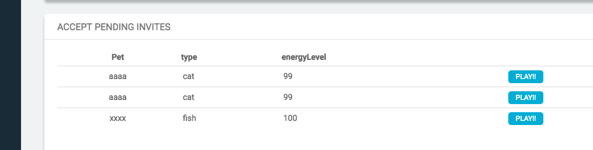

# MyVirtualPet

This is a simple Decentranied game developped using: web3.js truffle Solidity and angular

Developped by [Alvaro Gareppe](https://www.linkedin.com/in/agareppe/)

## Description
Anyone with a Ethereum wallet can play this simple game. To play you need to create your profile: pick your pet and pet Name

Each pet has an ehergy level, that decrements onece in a while. To increase the energy level (up to 100) the pets need to invite other pets to play. When a pet accepts the invite both gain 1 energy point

Really siemple game but:
- The user profiles are stored in Ethereun blockchain: including user data and energy level
- Request lifecycle are managed in the blockchain: invites, accetps, energy level
- A restricted operation allows the dame owner (contract creator) to decrement the pets Energy level to keep the game going ;)

## Software requirements
- Ganache (or some other ethereum instance)
- Node 
- Truffle
- Metamask (the game runns fully on the browser side, so Metamask will be used to connect to the Ethereum blockchain)

## Setup
Run this in sequence in the root folder of the project:
- npm install -g bower
- npm install -g gulp
- npm install
- truffle compile

### Solidity Unit tests (optional step)
Truffle was used to test the contract. To run the unit tests
- truffle test

## Running the application
- Run Ganache (defaul port location: 7545)
- truffle migrate
- cp -r build/contracts src/contracts
- import 3 user accounts from Ganache into Metamaks
    -   The one used to create the contract 
    -   2 others (anyone with creadit in Ganache)
- gulp serve    

## Demo

Home Page

Setting up user withMetamask: Pick the player account in metamask to switch users

Create profile: Update or create the user profile and pet info (asociated with the account)

* you can create as meny user as you want with different accounts

Invite a Friend to play: pick one from the list to invite

For operations that updates the contract data (profile creation, invites, accepts to play) you need to submit the transaction with Metamask

Accept Invites and gain energy 

Admin can decrements everyones energyLevel by 2 using the LessEnergy button on his profile

License
-------------
Just Enjoy!

